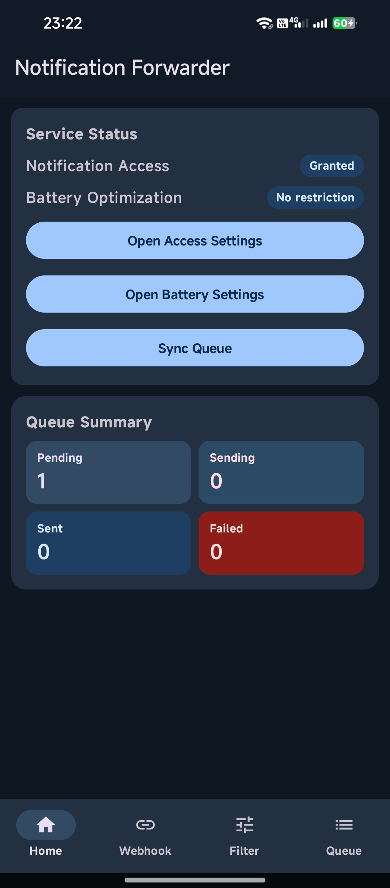
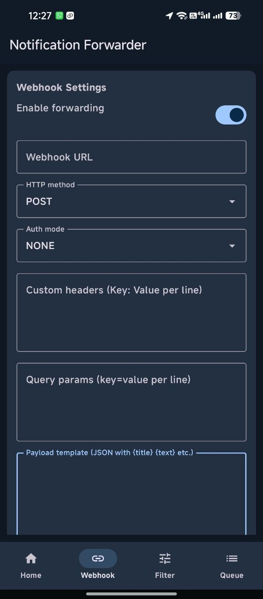
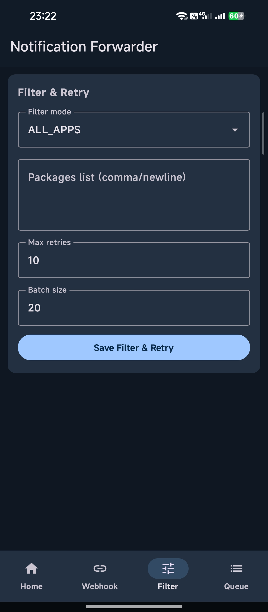
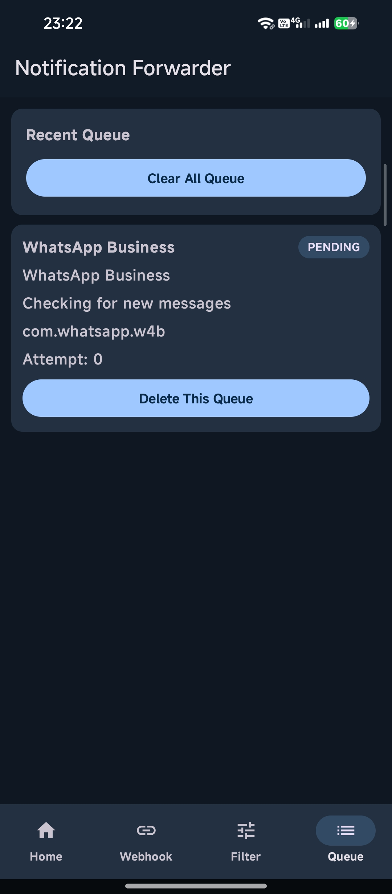

# Notification Forwarder (Android)

Android app to listen for incoming notifications and forward them to a configurable webhook API.

## Features

- Notification capture using `NotificationListenerService`
- Webhook forwarding with configurable URL, auth mode, and custom headers
- Queue system with Room (durable local storage)
- Retry system with WorkManager (network constraints + backoff)
- Background support
- Auto queue scheduling after reboot (`BOOT_COMPLETED`)

## Background Reliability Setup

1. Open app -> **Home**.
2. Tap **Open Access Settings** and enable Notification Access.
3. Tap **Open Battery Settings** and set app to no restriction if available.
4. On some OEM ROMs (MIUI/ColorOS/Funtouch), enable Auto Start for the app.

## Build

```bash
./gradlew assembleDebug
```

## Local Webhook API (`webhook/`)

This repository includes a Node.js webhook receiver in `webhook/` for local testing.

### Setup

```bash
cd webhook
npm install
cp .env.example .env
```

### Run

```bash
npm run start
```

Default endpoint:

- `POST /webhook`

Health check:

- `GET /health`

Environment config (`webhook/.env`):

- `HOST`
- `PORT`
- `WEBHOOK_PATH`
- `WEBHOOK_BEARER_TOKEN`
- `WEBHOOK_LOG_FILE`
- `JSON_LIMIT`

## Screenshots

### Home & Webhook Page




### Filter & Queue Page




## License

This project is licensed under the MIT License.
See [LICENSE](LICENSE) for details.
