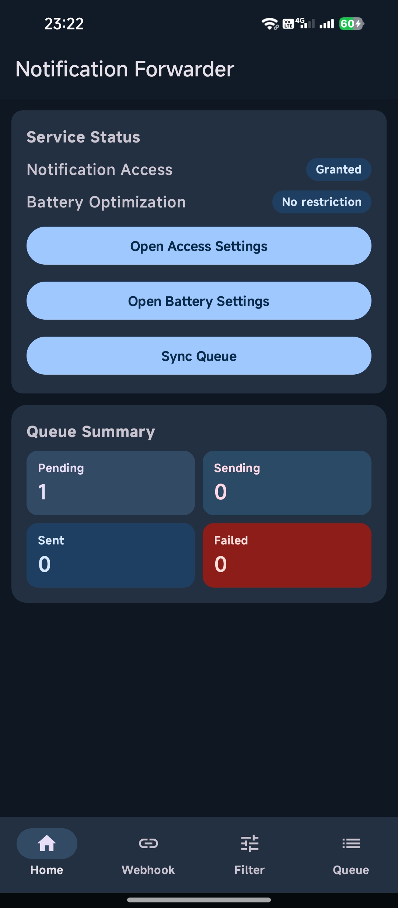
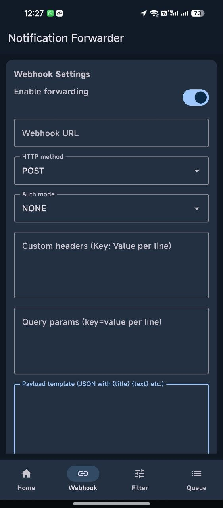
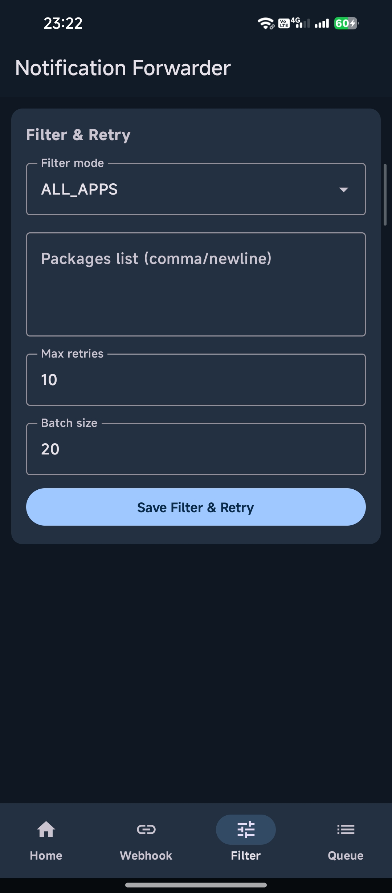
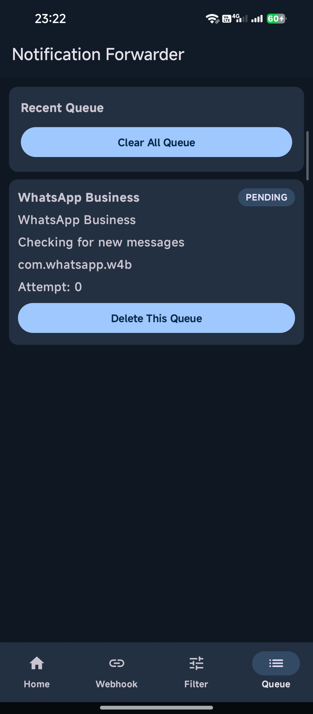

# Notification Forwarder (Android)

Android app to listen for incoming notifications and forward them to a configurable webhook API.

## Features

- Notification capture using `NotificationListenerService`
- Webhook forwarding with configurable URL, HTTP method, auth mode, custom headers, query params, and payload template
- Compatible with Telegram Bot API, Discord webhooks, and any custom API
- Queue system with Room (durable local storage)
- Retry system with WorkManager (network constraints + backoff)
- Background support
- Auto queue scheduling after reboot (`BOOT_COMPLETED`)

## Background Reliability Setup

1. Open app -> **Home**.
2. Tap **Open Access Settings** and enable Notification Access.
3. Tap **Open Battery Settings** and set app to no restriction if available.
4. On some OEM ROMs (MIUI/ColorOS/Funtouch), enable Auto Start for the app.

## Build

```bash
./gradlew assembleDebug
```

## Webhook Configuration

### Supported HTTP Methods
- `GET` — no request body, query params appended to URL
- `POST` — with JSON body
- `PUT` — with JSON body
- `PATCH` — with JSON body

### Authentication
- **None** — no auth header
- **Bearer** — adds `Authorization: Bearer <token>`
- **Custom** — define any headers manually

### Custom Query Params
Add per line as `key=value`:
```
chat_id=123456789
token=abc123
```

### Custom Payload Template
Use JSON with variable placeholders. Leave blank for default payload.

Available variables:
- `{deviceId}`
- `{packageName}`
- `{appName}`
- `{title}`
- `{text}`
- `{postedAt}`
- `{notificationKey}`

#### Example: Telegram Bot API
- URL: `https://api.telegram.org/bot<token>/sendMessage`
- Method: `POST`
- Payload template:
```json
{"chat_id":"123456789","text":"*{appName}*\n*{title}*\n{text}","parse_mode":"Markdown"}
```

#### Example: Discord Webhook
- URL: `https://discord.com/api/webhooks/.../...`
- Method: `POST`
- Payload template:
```json
{"content":"**{appName}**\n**{title}**\n{text}"}
```

#### Example: Custom GET API
- URL: `https://example.com/api/alert`
- Method: `GET`
- Query params:
```
device={deviceId}
msg={title}
```

## Local Webhook API (`webhook/`)

This repository includes a Node.js webhook receiver in `webhook/` for local testing.

### Setup

```bash
cd webhook
npm install
cp .env.example .env
```

### Run

```bash
npm run start
```

Default endpoint:

- `POST /webhook`

Health check:

- `GET /health`

Environment config (`webhook/.env`):

| Key | Description |
|-----|-------------|
| `HOST` | Server host |
| `PORT` | Server port |
| `WEBHOOK_PATH` | Webhook endpoint path |
| `WEBHOOK_BEARER_TOKEN` | Optional bearer token |
| `WEBHOOK_LOG_FILE` | Log file path |
| `JSON_LIMIT` | Max JSON body size |

## Screenshots

### Home & Webhook Page




### Filter & Queue Page




## Build

```bash
./gradlew clean assembleDebug
```

## License

This project is licensed under the MIT License.
See [LICENSE](LICENSE) for details.
